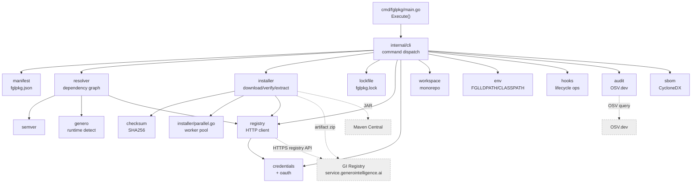
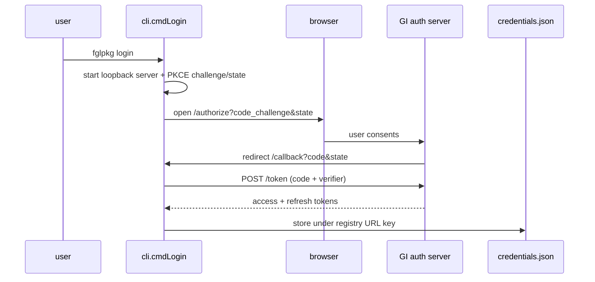

# fglpkg — Technical Architecture

**Date:** 2026-06-15
**Audience:** engineers new to the fglpkg codebase
**Scope:** the `fglpkg` CLI. The package registry is an **external** system owned
by `4js-genero-intelligence` (GI). The repo currently also contains an embedded
registry server under `internal/registry/server/`; that is being removed (see
[outstanding-work.md](outstanding-work.md), Workstream A), so this document
describes the **CLI** and treats the registry as a remote service.

---

## 1. Overview & design principles

fglpkg is a package manager for Genero BDL projects. It installs two kinds of
dependencies — **BDL packages** (`.42m`/`.42f`/`.sch`, distributed as zips) and
**Java JARs** (Maven coordinates) — and manages the runtime environment
(`FGLLDPATH`, `CLASSPATH`) so the Genero toolchain can find them.

Guiding principles, reflected throughout the code:

- **Reproducibility** — a committed `fglpkg.lock` pins every resolved version,
  download URL, and SHA256, so an install is repeatable.
- **Supply-chain safety** — every download is SHA256-verified in a single
  streaming pass; lifecycle **hooks are declarative** (`copy-files`/`mkdir`
  only), never arbitrary shell.
- **Multi-Genero support** — a package version can ship one build per Genero major
  version ("variants"); the resolver picks the one matching the local runtime.
- **Context-aware scope** — installs target a local `.fglpkg/` or the global
  `~/.fglpkg/` depending on the working directory, overridable with `--local`/
  `--global`.
- **Concurrency** — package and JAR downloads run in a bounded worker pool.

---

## 2. Component map



### Package responsibilities

| Package | File(s) | Responsibility |
|---|---|---|
| cli | [internal/cli/cli.go](../internal/cli/cli.go) | Command dispatch (`Execute()` switch), prompts, orchestration; wires auth into the registry client in `init()`. |
| manifest | [internal/manifest/manifest.go](../internal/manifest/manifest.go) | Parse/validate/save `fglpkg.json`; 3-tier dependencies (prod/dev/optional); `ValidateForPublish`; strict unknown-field rejection. |
| semver | [internal/semver/semver.go](../internal/semver/semver.go) | Parse versions and constraints (`^`, `~`, ranges, `\|\|`); pick the latest satisfying version. Used for package **and** Genero versions. |
| genero | [internal/genero/genero.go](../internal/genero/genero.go) | Detect the installed Genero runtime (`FGLPKG_GENERO_VERSION` override, else toolchain); `MajorString()` drives variant selection. |
| resolver | [internal/resolver/resolver.go](../internal/resolver/resolver.go) | BFS transitive resolution; filter candidates by Genero constraint + semver; scope promotion; workspace-local short-circuit; emits a `Plan`. |
| installer | [internal/installer/installer.go](../internal/installer/installer.go) | Install from lock (fast path) or from a fresh `Plan`; download, verify, extract; manage `~/.fglpkg/` vs `.fglpkg/`. |
| installer/parallel | [internal/installer/parallel.go](../internal/installer/parallel.go) | Bounded worker pool (`FGLPKG_INSTALL_CONCURRENCY`, default 4); serialized progress output. |
| lockfile | [internal/lockfile/lockfile.go](../internal/lockfile/lockfile.go) | Read/write/validate `fglpkg.lock`; freshness checks; `FilterForProduction`. |
| checksum | [internal/checksum/checksum.go](../internal/checksum/checksum.go) | Streaming SHA256 (`DigestingReader`) — hash while downloading. |
| credentials | [internal/credentials/credentials.go](../internal/credentials/credentials.go) | `~/.fglpkg/credentials.json` (0600); `ActiveBearer` (OAuth→PAT→env); `ForceRefresh`. |
| oauth | [internal/oauth/](../internal/oauth/) | Auth-code + PKCE login (`flow.go`), token model (`tokens.go`), PKCE (`pkce.go`), loopback server (`server.go`). |
| registry | [internal/registry/registry.go](../internal/registry/registry.go) | HTTP client for the GI `/registry/*` protocol — resolve/fetch/search (consumer) and create-package/version/upload/submit (publish). |
| github | [internal/github/github.go](../internal/github/github.go) | `VariantAssetName` (zip naming) and `IsGitHubURL` (download-auth selection). The release-API surface is legacy and being trimmed. |
| workspace | [internal/workspace/workspace.go](../internal/workspace/workspace.go) | Monorepo support; local members resolved from disk; shared lockfile. |
| env | [internal/env/env.go](../internal/env/env.go) | Emit shell exports for `FGLLDPATH`/`CLASSPATH` (incl. `--gst` Studio format). |
| hooks | [internal/hooks/hooks.go](../internal/hooks/hooks.go) | Run declarative lifecycle ops; path-traversal safe; no shell. |
| audit | [internal/audit/audit.go](../internal/audit/audit.go) | Query OSV.dev per JAR; report CVE/severity findings. |
| sbom | [internal/sbom/cyclonedx.go](../internal/sbom/cyclonedx.go) | Emit a CycloneDX SBOM from the lockfile. |
| cli helpers | `ignore.go`, `completion.go`, `info.go`, `outdated.go`, `pack.go`, `readme.go`, `templates.go`, `publish_validation.go` (under [internal/cli/](../internal/cli/)) | `.fglpkgignore` matching, shell completion, info/outdated, local zip build, README/USERGUIDE collection, `init` templates, prepublish checks. |

---

## 3. Key data structures

- **`manifest.Manifest`** ([manifest.go](../internal/manifest/manifest.go)) — the
  `fglpkg.json` shape: `Name`, `Version`, `Description`, `Author`, `License`,
  `Repository`, `Keywords`, `Visibility` (`public`/`private`),
  `GeneroConstraint` (`json:"genero"`), `Dependencies`/`DevDependencies`/
  `OptionalDependencies` (each `{fgl: map, java: []JavaDependency}`), `Root`,
  `Files`, `Bin`, `Docs`, `Programs`, `Hooks`.
- **`lockfile.LockFile`** ([lockfile.go](../internal/lockfile/lockfile.go)) —
  schema `Version`, `GeneratedAt`, `GeneroVersion` (at resolution time),
  `RootManifest{Name,Version}`, `Packages []LockedPackage`, `JARs []LockedJAR`.
  `LockedPackage` carries `Name`, `Version`, `DownloadURL`, `Checksum`,
  `GeneroMajor`, `RequiredBy`, `Scope`.
- **`registry.PackageInfo` / `VariantInfo`** ([registry.go](../internal/registry/registry.go))
  — resolved metadata for a version, including `DownloadURL`, `Checksum`, and a
  `Variants []VariantInfo` list (one per Genero major), plus `Readme`/`Userguide`.
- **`resolver.Plan` / `ResolvedPackage`** ([resolver.go](../internal/resolver/resolver.go))
  — the transitive closure: ordered `Packages`, `JARs`, workspace `LocalMembers`,
  `GeneroVersion`, and `OptionalSkipped`. Each `ResolvedPackage` records its
  `RequiredBy` chain and promoted `Scope`.

---

## 4. Core data-flow traces

### 4.1 `install` — fresh resolve

```mermaid
sequenceDiagram
    participant U as user
    participant CLI as cli.cmdInstall
    participant I as installer
    participant G as genero
    participant R as resolver
    participant Reg as GI registry
    participant L as lockfile
    participant FS as ~/.fglpkg or .fglpkg

    U->>CLI: fglpkg install
    CLI->>I: InstallAll(opts)
    I->>G: Detect() (runtime major, e.g. 6)
    I->>L: lock exists & valid & on disk?
    alt lock stale / missing
        I->>R: Resolve(manifest, generoMajor)
        loop BFS over deps
            R->>Reg: version list + PackageInfo
            R->>R: filter by genero constraint + semver; pick variant; promote scope
        end
        R-->>I: Plan (packages, JARs)
        I->>L: write fglpkg.lock
        I->>I: install from Plan (parallel)
        par bounded worker pool
            I->>Reg: GET artifact zip
            I->>I: SHA256 verify (streaming)
            I->>FS: extract to packages/<name>/
        and
            I->>Reg: GET JAR (or Maven)
            I->>FS: jars/<artifact>.jar (verify)
        end
    else lock fresh
        I->>I: install from lock (see 4.2)
    end
```

**Local vs global:** the install scope is auto-detected — a `.fglpkg/` directory or
a `fglpkg.json` in the working directory selects local (`.fglpkg/`); otherwise
global (`~/.fglpkg/`). `--local`/`-l` and `--global`/`-g` force it. Concurrency is
bounded by `installer/parallel.go` (default 4, `FGLPKG_INSTALL_CONCURRENCY`).

### 4.2 `install` — from lockfile (fast path)

`installFromLock` ([installer.go](../internal/installer/installer.go)) skips
resolution entirely: it filters out packages/JARs already present on disk, then
runs the same parallel download → SHA256-verify → extract over the remainder.
Download URLs read from an older lock are normalized to absolute form via
`registry.AbsoluteDownloadURL` before the GET.

### 4.3 `publish`

```mermaid
sequenceDiagram
    participant U as user
    participant P as cli.cmdPublish/publishPackage
    participant G as genero
    participant Reg as GI registry (/registry/*)

    U->>P: fglpkg publish [--dry-run|--ci]
    P->>P: manifest.ValidateForPublish()
    P->>G: Detect() -> generoMajor (variant key)
    P->>P: check this variant not already published
    P->>P: build zip (Files globs, bin, docs, .fglpkgignore) + SHA256
    P->>P: collect metadata: repo/author/license/genero/deps<br/>+ README/USERGUIDE (256 KB truncate)
    P->>Reg: POST /registry/packages (create slug; 409 ok)
    P->>Reg: POST .../versions (version + metadata; 409 => add variant)
    P->>Reg: PUT  .../versions/:v/artifacts/:variant (stream zip -> R2)
    P->>Reg: POST .../versions/:v/submit (pending admin review)
```

`--dry-run` prints the planned calls and the metadata block (with doc sizes /
`(truncated)`) without any network I/O. `--ci` requires a token from the
environment (`FGLPKG_TOKEN`) and prints a stable machine-readable status line.
Visibility is sent from the manifest (`public` when omitted — see
[outstanding-work.md](outstanding-work.md) §3.2).

### 4.4 Authentication (OAuth auth-code + PKCE)



At startup, `cli.init()` wires `registry.Bearer` and `registry.TryRefresh` to
`credentials.ActiveBearer`/`ForceRefresh`, so every registry call transparently
resolves the current token (OAuth access → PAT → env) and, on a `401`, performs a
**silent refresh** and retries once. `fglpkg login --token <PAT>` stores a PAT
directly for non-interactive use.

### 4.5 Dependency resolution & Genero variants

The resolver passes the detected Genero **major** to the registry. For each
candidate version it (a) filters by the package's `genero` constraint against the
local runtime and (b) picks the artifact variant matching the major (`genero6`,
…), falling back to a `default` variant, then to the first artifact. The selected
`DownloadURL` + `Checksum` flow into the `Plan` and then the lockfile, so the same
variant is reinstalled deterministically.

---

## 5. External integrations

| Service | Protocol | Used for | Code |
|---|---|---|---|
| **GI registry** | HTTPS `/registry/*` | resolve, fetch, search, publish; artifact download (R2-backed) | [registry.go](../internal/registry/registry.go) |
| **Maven Central** | HTTPS | Java JAR downloads | `manifest.JavaDependency.MavenURL()` |
| **OSV.dev** | HTTPS `/v1/query` | vulnerability audit (one query per JAR) | [audit.go](../internal/audit/audit.go) |
| GitHub (download auth branch) | HTTPS | legacy private-asset download path | [installer.go](../internal/installer/installer.go), `gh.IsGitHubURL` |

> The legacy `fglpkg-registry.fly.dev` backend and the GitHub-Releases publish path
> are being removed (Workstream A). The GI registry is the single backend.

---

## 6. Home-directory & project layout

```
~/.fglpkg/                 # global (override with FGLPKG_HOME)
├── packages/<name>/...    # extracted BDL packages
├── jars/<artifact>.jar    # Java JARs
└── credentials.json       # OAuth/PAT per registry (mode 0600)

<project>/
├── fglpkg.json            # manifest
├── fglpkg.lock            # lockfile (commit to VCS)
├── .fglpkg/               # local install (gitignore)
│   ├── packages/  └─ jars/
├── README.md  USERGUIDE.md  # bundled + sent as publish metadata
└── .fglpkgignore          # globs excluded from the publish zip

<monorepo>/
├── fglpkg.workspace.json  # member list
├── fglpkg.lock            # single shared lock
└── <member>/fglpkg.json   # local members resolved from disk
```

`credentials.json` is keyed by registry URL; each entry holds an `oauth` block
(access/refresh/expiry/scope/client_id) and/or a PAT.

---

## 7. Build & release

- **[cmd/build.sh](../cmd/build.sh)** — cross-compiles 6 targets (linux/darwin/
  windows × arm64/amd64). Version/build are injected via `-ldflags` into
  `internal/cli.Version`/`Build`. `FGLPKG_VERSION` overrides the default.
- **[.github/workflows/ci.yml](../.github/workflows/ci.yml)** — `go vet`, `go test`
  (race), build. **release.yml** — on a `v*` tag, builds the binaries + checksums
  and publishes a GitHub Release.
- Installation: drop the platform binary on `PATH` and add
  `eval "$(fglpkg env --global)"` to the shell profile.

---

## 8. Forward note

The target state of this repo is **CLI-only**. The embedded registry server
(`internal/registry/server/`, `cmd/registry/`) and the legacy fly.dev coupling are
scheduled for removal (see [outstanding-work.md](outstanding-work.md), Workstream
A). The registry contract — the `/registry/*` protocol, tenant-scoped visibility,
and admin operations — is owned by `4js-genero-intelligence`.
